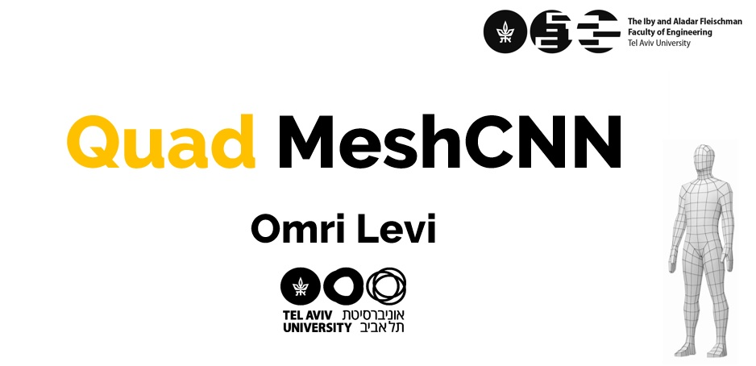
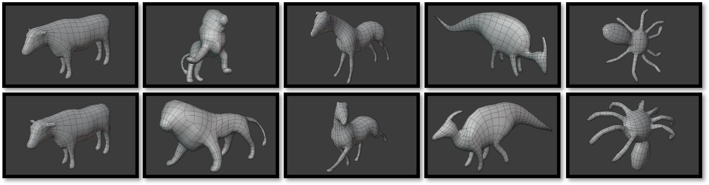
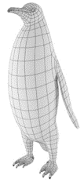

<br><br><br>

# QuadMeshCNN in PyTorch


QuadMeshCNN is an extension of MeshCNN method, which is a general-purpose deep neural network for 3D shapes, which can be used for tasks such as 3D shape classification. This framework includes convolution, pooling and unpooling layers which are applied directly on the mesh edges.


The code was adjusted to 3D quad meshes by [Omri Levi](https://www.linkedin.com/in/omri-levi-063167109/) as part of the requirements for the Degree of M.Sc in EE at TAU.
Original code from [MeshCNN](https://github.com/ranahanocka/MeshCNN.git) by [Rana Hanocka](https://www.cs.tau.ac.il/~hanocka/)

# Getting Started

### Installation
- Clone this repo:
```bash
git clone https://github.com/Omri-L/QuadMeshCNN
cd QuadMeshCNN
```
- Install dependencies: [PyTorch](https://pytorch.org/) version 1.2. <i> Optional </i>: [tensorboardX](https://github.com/lanpa/tensorboardX) for training plots.
  - Via new conda environment `conda env create -f environment.yml` (creates an environment called quadmeshcnn)
  
### 3D Shape Classification on QuadZoo5

Download the dataset - [link](https://drive.google.com/file/d/1A1h_3teFS51H7hTw-Omphe8IQfDHEZth/view?usp=sharing)


Run training (if using conda env first activate env e.g. ```source activate quadmeshcnn```)
```bash
bash ./scripts/shrec/train.sh TODO!!!!!
```

To view the training loss plots, in another terminal run ```tensorboard --logdir runs``` or ```tensorboard --logdir runs --bind_all``` (if you are not on your local machine).
Copy the URL generated by the command and paste on your browser.

Run test and export the intermediate pooled meshes:
TODO!!!!!

Visualize the network-learned edge collapses:
TODO!!!!!

An example of collapses for a mesh:


# Citation
If you find this code useful, please consider citing our paper
```
@article{hanocka2019meshcnn,
  title={MeshCNN: A Network with an Edge},
  author={Hanocka, Rana and Hertz, Amir and Fish, Noa and Giryes, Raja and Fleishman, Shachar and Cohen-Or, Daniel},
  journal={ACM Transactions on Graphics (TOG)},
  volume={38},
  number={4},
  pages = {90:1--90:12},
  year={2019},
  publisher={ACM}
}
```
  
# Acknowledgments
Original code from [MeshCNN](https://github.com/ranahanocka/MeshCNN.git).

This code design was adopted from [pytorch-CycleGAN-and-pix2pix](https://github.com/junyanz/pytorch-CycleGAN-and-pix2pix).

Quad mesh illustration images are from: [human_link](https://3dmodelsz.blogspot.com/2020/03/3d-human-mesh.html), [penguin_link](https://3docean.net/item/penguin-base-mesh/9190779)


